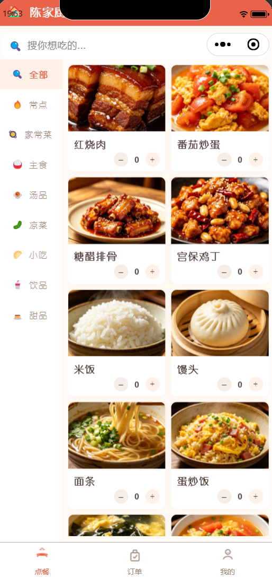
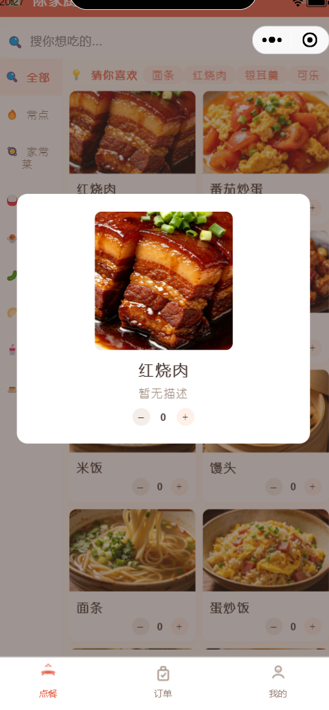
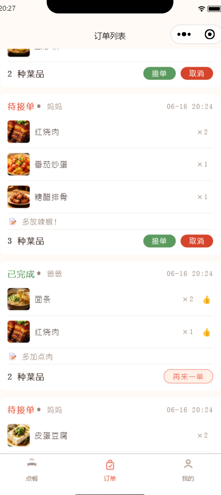
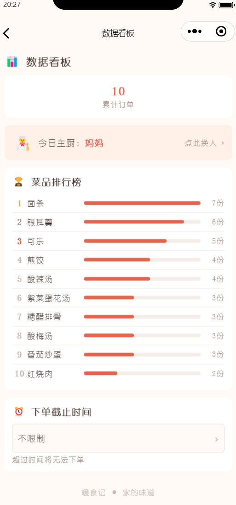
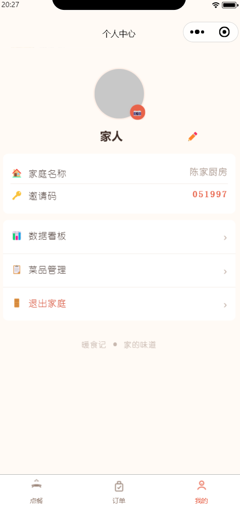

# 🍳 暖食记 — 家庭协作点餐小程序

> 不是在美团上点外卖，是一家人共享的厨房菜单。

## ✨ 核心功能

- 🏠 **多家庭成员协作**：创建家庭 → 邀请码加入，人人平等，都能发布菜品、下单、接单
- 📋 **28 道默认菜品**：7 个分类，开箱即用，每道菜配真实图片
- 🛒 **购物车式点单**：左侧分类、右侧菜品网格，加菜动画反馈
- 📝 **订单备注**：下单时写「少盐」「不要香菜」
- 👨‍🍳 **主厨轮值**：每天自动轮换今日主厨，在首页展示
- 📊 **数据看板**：菜品排行榜、家庭订单趋势、个人常点统计
- 🔔 **实时通知**：有人下单 → 全家人收到提醒
- 💡 **智能推荐**：「猜你喜欢」——家庭热门菜里你没点过的
- 👍 **菜品反馈**：完成订单后可评价每道菜

## 🖼️ 界面预览

| 点餐首页 | 菜品详情 | 订单列表 | 数据看板 | 个人中心 |
|---------|---------|---------|---------|---------|
|  |  |  |  |  |

## 🛠️ 技术栈

| 层 | 技术 |
|---|------|
| 前端 | uni-app (Vue3 Composition API) + Pinia |
| 后端 | Spring Boot 3.2 + MyBatis-Plus 3.5 |
| 数据库 | MySQL 8.0 |
| 认证 | JWT (jjwt) + 微信 OAuth |
| 工具 | Lombok / Knife4j / Maven |

## 📐 架构

```
client/                  uni-app 前端 (Vue3)
  ├── pages/
  │   ├── index/         点餐首页 (分类+菜品+购物车)
  │   ├── order/         确认下单
  │   ├── order-list/    订单列表+通知+反馈
  │   ├── manage/        菜品管理 (CRUD)
  │   ├── stats/         数据看板
  │   └── mine/          个人中心+设置
  ├── api/request.js     统一请求封装
  └── stores/cart.js     Pinia 购物车

server/                  Spring Boot 后端
  ├── controller/        6 个控制器
  ├── service/           5 个业务服务
  ├── entity/            10 张数据表
  └── security/          JWT 拦截器
```

## 🗄️ 数据库设计

```
user ──┬── family_member ──┬── family ──┬── category ──┬── dish
       │                   │            │              └── frequent_dish
       │                   │            ├── chef_schedule (today_chef_id)
       │                   │            ├── notification
       │                   │            └── order ── order_item
       └── (order.user_id) ┘
```

核心关系：**一个人 → 加入一个家庭 → 家庭里有分类和菜品 → 下单产生订单**

## 🚀 本地运行

```bash
# 1. 启动后端
cd server
mvn spring-boot:run -DskipTests
# → http://localhost:8080

# 2. 打开前端
# HBuilderX → 导入 client/ → 运行到小程序模拟器
```

要求：JDK 17 + MySQL 8.0 (root/1234, 数据库 familyfood_db)

## 📝 需求文档

详见 [docs/requirements.md](docs/requirements.md)

---

*CS 大二暑假项目 · 独立全栈开发*
